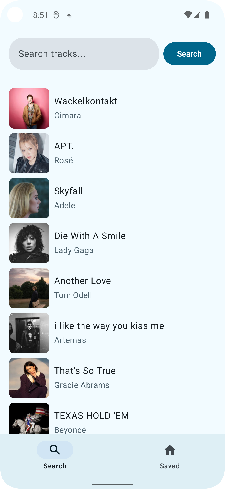
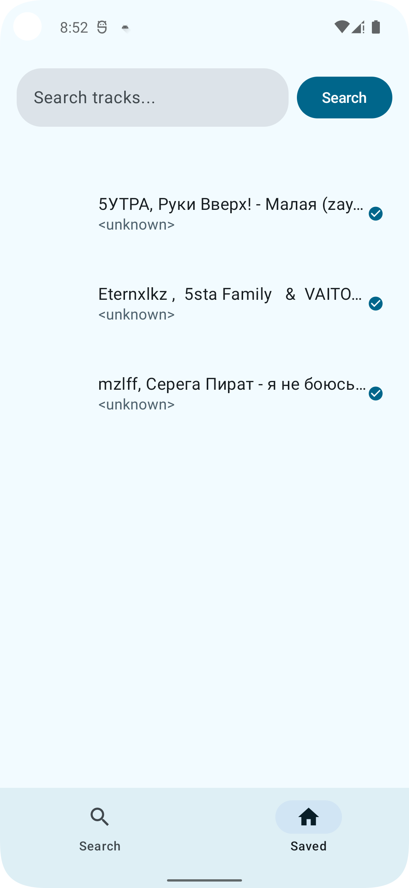
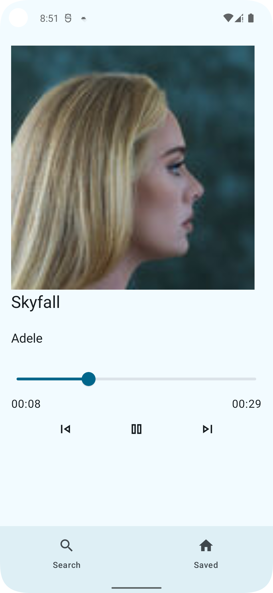
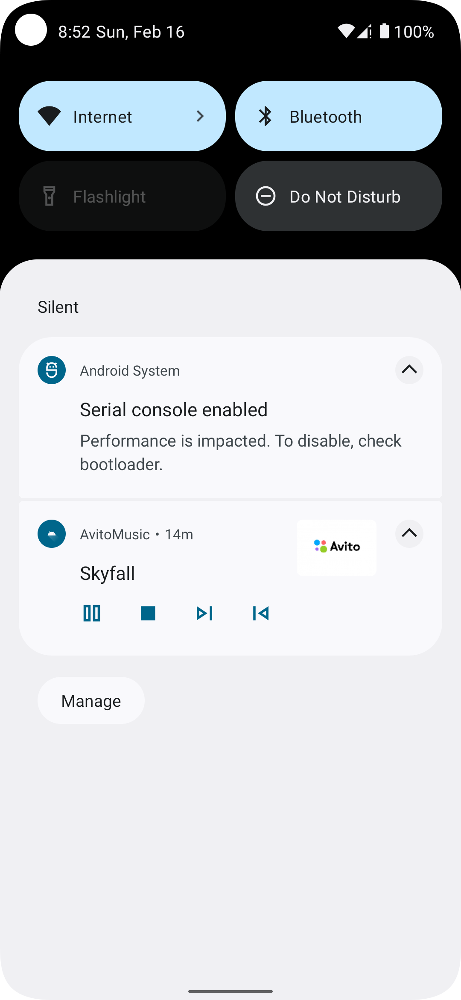

### Запуск
Этот проект использует систему сборки Gradle. Чтобы собрать этот проект, используйте команду "gradlew build" или "Import Project" в Android Studio.

---

### Версии
Проект создавался и тестировался на Android 12(API 32), на данной версии android всё работает исправно. По этой причине стоит запускать приложение на версии Android <= 12,но преимущественно на 12. Также насчёт playback notification. На эмуляторе разрешение на выдачу уведомлений не требуется и всё работает исправно. Если же уведомления после установки не работают(как на физических устройствах), нужно их разрешить: зайти в `App Info -> Notifications -> On (О приложении -> Управление уведомлениями -> Разрешить)`

---

### API
В данном проекте было использовано API Deezer
https://developers.deezer.com

---

### Технологии и методологии
- `Clean Architecture` - здесь стоит сделать оговороку насчёт моделей. В моём случае у меня не используются сущности `Entities`, так как в них нет никакой необходимости, ибо я никак не видоизменяю сами модели и использую их в исходном состоянии.
- `MVVM Pattern`
- `Hilt` - Был выбран мной в качестве инструмента для di, т.к. он основан на библиотеке Dagger, треубет меньшего объёма написанного кода и более удобную интеграцию с Jetpack Compose
- `MediaPlayer`
- `Media Store`
- `Jetpack Compose`

---

### Библиотеки
- [Coil](https://github.com/coil-kt/coil)
- [Hilt](https://dagger.dev/hilt/)
- [Jetpack Compose](https://developer.android.com/compose)
- [Gson](https://github.com/google/gson)
- [OkHttp](https://github.com/square/okhttp)
- [Retrofit](https://github.com/square/retrofit)

---

### Скриншоты

  
  
  
  

---

### upd: Изменение README согласовано с командой стажировок